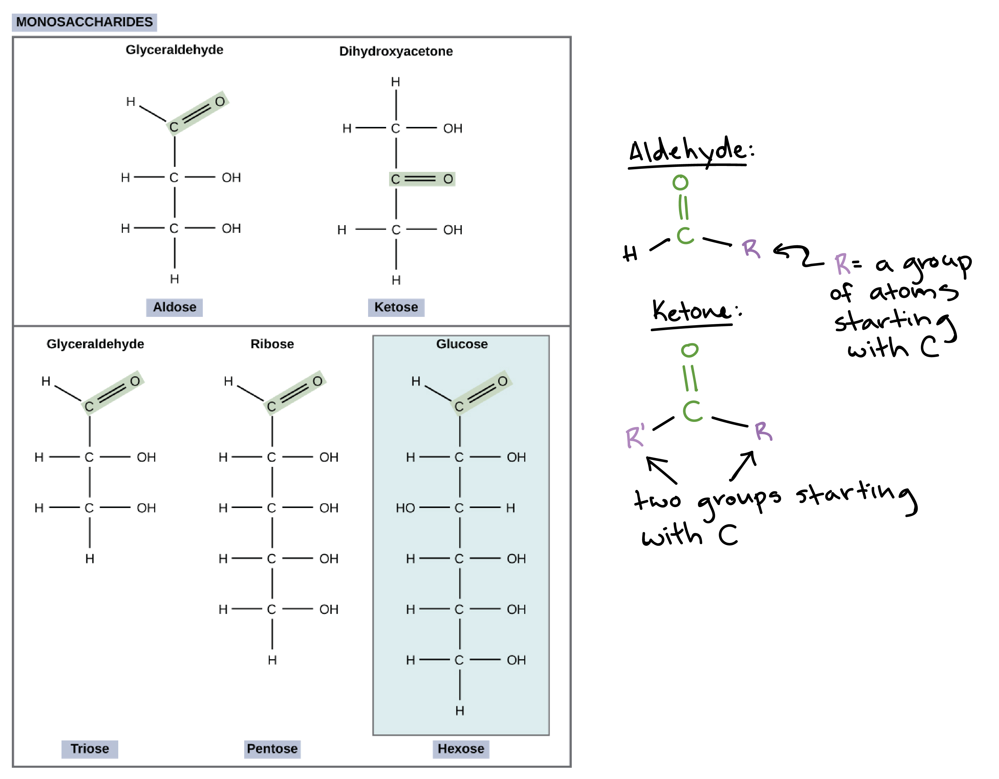

# atoms

Protons and electrons have inverse *charges*. A charge is more accurately described as a force that makes things to reduce their respective distances. Those two things have to have "opposite" charges -- what we call "positive" and "negative". These charges could be labelled "x" and "y" for all we care -- the labels are arbitrary. The important note is that these two charges are complementary -- on attracts the other. Two of the same charges always repel.

The "amount" of for a certain object in a system is reduced by other nearby objects. Two oppositely charged objects mutually reduce their charges. Two objects with the same charge likely increase each other charges, at least temporarily (until they move away from each other).

Positive and negative are attracted to each other in an inverse proportion to the square of the distance between them. This sounds exactly like gravity. **Strange**!

All of this is rooted in corpuscularianism: the idea that everything reduces to particles, or points. I think this actually makes little sense, considering that electrons take up 3d space. Why can't the fundamental shape be a 3d density cloud, where we abandon the notion of particles? (or strings, lol?)

Why are protons and neutrons bound together? Wouldn't protons have a very strong tendency to repel one another, since they are all positive?

Apparently there is another orthogonal force called "nuclear force" that is stronger than electromagnetism and causes proton-neutron bonds in the nuclei

*Orthogonal force* is a term I just made up: it denotes forces that do not affect each other, but may override each other spatially.

How does the electron "communicate" with the proton, and vice versa, to convey that it is nearby, and what its exact force is?

How do we reconcile the positive/negative force of protons/neutrons with the valence electron forces? What do we really mean when we say the atom "wants" four more electrons when it has four in its second shell? Is this force the same as electric charge / electromagnetism, or is this valence-shell force totally separate?

An atom's **atomic number** is its number of protons

A **positive charge** means the atom is **missing** an electron, while a **negative** charge means the atom is **wanting** an electron. To miss or to want means the number of atoms is less than or greater than its number of protons, respectively.

**Positive**: want _more_ electrons

**Negative**: want to _lose_ electrons

To **ionize** means to lose an electron

A **mole** is simply a name for a quantity (6.22 * 10^23 of something)

## bonds

Two major bonds are ionic and covalent bonds -- these are generally considered "strong". Both of these are inter-atom -- that is they bond atoms directly to other atoms.

Some weaker bonds are "inter-molecular" -- they bond whole molecular structures to other molecules. These include hydrogen bonds and "London dispersion forces".

An elecronegative charge of a substance is just an **average** over time, and may not always be the case (ie. in water)

### ionic

Ionic bonds require two atoms with incomplete valence shells. One has very few electrons in its shell, so it wants to lose electrons. The other has just under the valence shell total, meaning it wants to gain electrons. The two atoms then exchange electrons, where the first becomse a cation (missing electrons), and the second becomes an anion (extra electrons). Now that the two atoms are oppositely charges, they are now bound together as a whole.

### covalent

Two atoms with incomplete valence shells can form covalent bonds: each atom contributes one valence electron to create a shared pair. That is, they each effectively gain a new electron and some amount of its negative charge, lowering the atom's overall positive charge.

Atoms with incomplete valence shells are slightly positively charged, even though they might have the same number of protons and electrons.

### coordinate bond

When two atoms bond and one of the atoms contribute both electrons in the bond

### adhesion, cohesion, and capillary action

**Cohesion** is when a strong bond is formed within **the same** substance, like the surface tension of water.

This bond forms at the surface because the water has little attraction to air. Since air surrounds the entire top side of the molecules, then the molecules have more electromagnetic force to attach to each other. Within the liquid, where there is no air contact, the water molecules have more electromagnetic force on every side, so the bond in any specific direction is not as strong as at the surface.

**Adhesion** is when two separate substances form a bond (any kind?)

**Capillary action** is when the interaction of a substance in a container and the container walls causes the substance to climb the walls.

* This is because the bond between the substance and the wall is stronger than gravity.
* The key defining concept of capillary action is that it **counteracts gravity**

### hydrogen bonds

Water has a positive charge near the hydrogen ends, and a negative charge at the water end. This is because oxygen has 8 electrons, with a 6-electron valence shell (missing 2), so has a strong force to gain electrons (a positive force). The hydrogens have 1 electron in their valence shell. Each hydrogen shares an electron with water, giving water 8 electrons in its valence shell and each hydrogen 2 electrons in its valence shell.

However, water's force to attract electrons is strong than hydrogen's because is valence shell is higher. Therefore, water will "hog" the shared covalent electrons with hydrogen. The oxygen side of the molecule thus is more electronegative, while the hydrogen is slightly positive.

A water molecule can then form bonds with other water molecules: the hydrogen sides bond to the oxygen sides, while the oxygen sides bond to the hydrogen sides.

**Water gets less dense when it freezes**

Water
 frozen state
  less dess than liquid state
    because hydrogen bond is strongest -- holds molecules at a set, crystalline configuration at a certain distance
 liquid state
  more dense than frozen state
    because hydrogen bond is weaker -- overridden by other forces (temp?) that compress the molecules together

### autoionization (self-ionization)

Water can **exchange protons** among its molecules (very infrequently). That is, it can exchange cation hydrogens

To "lose a proton" means to "lose the nucleus" -- ie. the atom travels without any of its electrons

In the case of water self-ionization, the hydrogen atom moves to a neighboring water molecule without taking any electrons

The hydrogen nucleus is H+

When two water molecules exchange protons, we produce hydronium and hydroxide. Hydronium has stolen the hydrogen nucleus from hydroxide.

Hydronium (H_30+) and Hydroxide (OH-).

## heat

Heat - energy transfer -- energy in transit -- when energy is converted from one form to another, that state of transition is "heat"
Temperature - a measure of the average kinetic of the molecules of a substance
Kinetic energy - energy of motion

Temperature: amount of kinetic energy in a substance. Transfers to nearby substances (how?)

Water molecules can break and reform more easily, since they have more flexible (weaker?) hydrogen bonds. This breaking and reforming can **absorb** added heat (kinetic energy?), which makes it harder to heat up water

TODO I am not sure what many of the above terms mean and imply.

### specific heat

The amount of **energy** needed to raise 1g of a substance by 1-degree celsius.

TODO refine the above definition with a stronger concept of "energy"
TODO refine the meaning of "substance" and "touching substances"

A _touching_ (?) substance with high energy transfers energy.
_Increased pressure_ increases energy of a substance.

Pressure is the force exerted by a substance _on its container_. Higher heat causes higher temperature.

### evaporative cooling

Hot air causes evaporated water because ???
TODO why does water evaporate?

The evaporation lowers the temperature of:
- the substance touching the water
- the water itself
- the water vapor
- the air in contact with the vapor

TODO describe why the above points happen

## Bonds

*carbonyl*
```
C
‖
O
```

## acids & bases

### Arrhenius definition

An **acid** increases the concentration of hydrogen protons when put in an aqueous solution

A **base** increases the conccentration of hydroxide when put in an aqueous solution 

If hydrochloric acid goes in an aqueous solution, the hydrogen nucleus (its proton) separates from the chlorine, thus making a positively charged hydrogen and negatively charged chlorine.

When sodium hydroxide (NaOH) is put into an aqueous solution, then it separates to Na+ and OH-, thus it is a base (see definition above).

NaOH separates (maybe?) in this way in water because of the dipole charge in H_2O, the O pulls Na+ while the H_2 pulls the OH-

TODO check the above reasoning

### Bronsted-Lowrey definition

This is a more commonly used definition

An **acid** is a hydrogen ion (H+) donor

A **base** is a hydrogen ion (H+) acceptor

In a reaction between HCl (hydrogen + chlorine) and water (H_2O):

  * The hydrochloric acid is a dipole -- the chlorine is very electronegative (its atomic number is 17), while the hydrogen is positive
  * The hydrogen pops off the HCl to bond with the Oxygen in H_2O. 
  * The Chlorine is left electronegative because the hydrogen has abandoned its electron to it in favor of sharing oxygen electrons
  * Thus it is an acid: it is a H+ donor

### pH

**Molar** is a term that means "moles per liter"

`1*10^(-3.5) molar` means there is that amount of molecules per liter in a substance

Orange juice has roughy `1*10^(-4)` molar hydrogen ions. This is compared to water, which has `1*10(-7)`. This means orange juice is more of an acid: it has more hydrogen ions and is thus more of an H+ donor.

`pH = -log(H+)`
or
`pH = -log(H_3O+)`

It is the logarithm (base 10) of the hydrogen ions or the hydronium

Thus the pH of 1 liter of water is `pH = -log(10^(-7))` which is equivalent to `7`

Thus the **lower the pH** the more acidic (meaning the more H+ ions are in the substance per liter) and the **higher the pH** the more basic (meaning less H+ ions per liter)

Remember the pH scale is **logarithmic** and thus has exponential jumps in its scale -- eg a pH of 7 has 10 times less hydrogen ions than a pH of 6

### Buffers

A buffer is a substance that tends to keep a pH level the same: when there are too many H+ ions, then it absorbs them, and when the are not enough, it tends to produce H+ ions.

For example, in blood, carbonic acid (H_2CO_3) gives and takes Hydrogen ions (to become HCO_3-)

## Carbon

Carbon has 4 valence electrons and thus often bonds with hydrogens or chains of other carbons

Carbon and hydrogen can form many different structural combinations. Two carbons can also form multiple covalent bonds with each other. Many varying lattice structures 

(definition) Isomer: two molecules with the same atomic constituents but different bonded structures.

3d spatiality is essential to the behavior of molecules. Carbon chains can have all the same atoms, but have different arrangements. These arrangements can even be mirror images of each other, and they are different molecules.

Why are two molecules that are exactly the same as each other, but mirror images, considered different molecules? Maybe the key difference is how they interact with other molecules. Mirror-image molecules will bond differently, in a geometric way, with surrounding molecules.

"carbonyl" - carbon double-bonded to an oxygen at the end
"aldehyde" - carbon double-bonded with oxygen and single-bonded with hydrogen (in a triangle)
"hydroxyl" - oxygen-hydrogen
"hydronium - three hydrogens and one oxygen

## Carbohydrates



Carbohydrates are **carbon and water** -- they have a roughly 1:1 ratio of carbon atoms to water molecules

Glucose: six carbons bonded to one carbonyl at one side, and the other five bonded to hydroxyls.

The oxygens in these carbon chains can sometimes connect back to another carbon further back in the chain, because oxygen is negative and carbon is positive

TODO fructose, glucose, pyranose, furanose -- compare and contrast!

TODO how does glucose bond with fructose to create sucrose

TODO what is the "-ase" suffix? related prefixes/suffixes?

"aldose" - has an aldehyde group (see above)
"ketose" - has a ketone group
"carboxyl" - C(=O)OH -- carbon double bonded with oxygen, bonded with hydroxide, and bonded to a carbon chain (R)

ketones are **a type** of carbonyl group
The ketone is a carbonyl that is in **the middle** of the carbon chain molecule
If the carbonyl is at **the end** of the carbon chain, then it is an aldehyde

Glucose, galactose, and fructose are all isomers of each other.


TODO define ketone

"cellulose" - a carbon chain of alternating inverted glucoses -- produced by plants -- indigestible by us
"chitin" - a polymer silimar to cellulose found in insect exoskeletons (there is some kind of nitrogen bond involved)

## Lipids

Lipids are very similar to carbohydrates -- carbon chains with hydrogen and oxygen. Tryglycerides are three carbon chains bonded at the ends to another carbon chain. The details don't seem super important at this stage -- it is different variations of covalent bonds involving hydrogen, oxygen, and carbon.

Saturated fats are carbon chain where all carbon bonds single-bonded with each other, and single-bonded with hydrogen. The chain is "fully saturated" with hydrogen -- there are no carbon double-bonds anywhere. All these hydrogens means this fat is dense -- that is why it is solid at room temp.

An "unsaturated fat" and "polyunsaturated fat" have at least one carbon double bond, making them less dense (less hydrogens) -- liquid form in room temp.

A "trans fat" is created by pumping hydrogen gas through a bunch of cis-unsaturated fats, somehow making the chain trans (straight) and thus more dense
TODO refine the above description

[lipid structure](./lipid-structure.png)

[saturated and unsaturated fats diagrams](./saturation-of-fats.png)

A cell wall has a hydrophilic part of a molecule facing the water, with a hydrophobic part facing inward, which blocks water from passing. See the diagram below.

[phospholipids diagam](./phospholipids.png)

"micelle" - drop a random goop of phospholipids into water and they form a sphere-like structure automatically. Amazing.

TODO study this passage!: A micelle is an ordered structure, but its formation actually increases the entropy (disorder, or number of microstates) of the system, as compared to having the phospholipids distributed among the water molecules. That's because the fatty acid tails of the phospholipids limit the number of microstates available to the water molecules they touch, in that the water molecules must form a sort of cavity surrounding each phospholipid tails. Sequestering the fatty acid tails on the inside of a micelle frees up the water molecules, allowing the system to take on a greater number of microstates (that is, increasing its entropy)^{7,8}

"steroids" have four fused carbon rings and often have a carbon chain tail which distinguishes them

steroids include "cortisol", "cholesterol", 

[steroid diagram](./steroids.png)

TODO define and expand on "ester" bonds

## DNA

TODO internalize the structure completely

What other geometric structures could DNA have?
Why is DNA comprised of the specific elements that it has?

DNA has a ribose sugar in its spines that has just hydrogen connected, while RNA has a hydroxyl (OH) connected
TODO why this difference? Why aren't they both deoxyribose or both reg ribose?

RNA has Uracil (U) while DNA has Thymine (T). Uracil is the same as thymine minus a "methyl group" -- a single carbon tale gets removed.
TODO find out more why 

Uracil is "less stable" than thymine.

*eukaryotes* have their DNA in a cell nucleus -- a special membrane-shielded central chamber in the cell
*prokaryoutes* have their DNA uncontained in a "nucleoid", which some kind of region in the cell, unenclosed

a *chromosome* is a linear piece of DNA, and are perhaps discrete codes with focused purposes for the cell

DNA often encodes instructions for building proteins
DNA is transcribed into some RNA (messenger-RNA or mRNA), which then gets used to build a protein

Nucleotide Diagram: [nucleic acids](./nucleic-acids.png)

tRNA -- transfer RNA -- bring amino acids to the ribosome for protein synthesis (TODO)
rRNA -- structural components of ribosomes (TODO)
mRNA -- messenger RNA -- transcribed instructions from DNA for building proteins
miRNA -- micro-RNA -- "regulators" of other genes (TODO)
siRNA -- small interfering RNA -- serves some kind of accessory function to mRNA (TODO what? why?)

Ribosomes assemble proteins out of amino acids using mRNA
The ribosome reads codons -- groups of three nucleotides -- from the mRNA
Each codon produces a particular amino acid
Ribosomes also use tRNA (TODO how? why?)
Transfer RNAs (tRNA) bring amino acids to the ribosome and somehow provide assurance that the amino acid created is correct according to the mRNA (TODO how? why?)

TODO ribosome related to ribose?

[Ribosome diagram](./ribosome-diagram.png)

ATGC and U are all bases -- meaning they can pick up a hydrogen (TODO why?)

Cytosine, Uranine, and Thymine are all *pyrimidines* meaning they have a single carbon ring (TODO etymology)

Adenine and Guanine are both *purines* meaning they have a double carbon ring (TODO etymology)

The complement of a sequence includes a reversal. example:
DNA: 5' ATGC 3'
RNA: 5' GCAU 3'

*Transcription*: DNA (gene) -> mRNA
*Translation*: mRNA -> amino acids (protein)

## Proteins

Proteins have a base molecule of this form (called a *peptide*):

```
H    H    O
 \   |   //
  N--C--C
 /   |  \
H    R  OH
```

The `R` is a "side chain" and is what differententiates proteins from each other.
The left side is the "amino group" (the "N-terminus"), while the right is the "carboxyl group" (the "C-terminus")

When a protein is in the body, it actually has the form:

```
H    H    O
 \   |   //
  N--C--C
 /   |  \
H    R   O
```

This is because the body is slightly basic (pH ~7.3) so accepts the extra hydrogen at top right
In this case, the right side is a "carbonyl group"

Vague functions of proteins:

* Break down nutrients
* Carry substances
* Constitute structures (eg cytoskeleton)
* Hormone signaling -- coordinating other activities
* Protect the body from foreign pathogens
* Muscle contraction
* Storage (food in eggs)

Two peptides can bond and produce one water byproduct. The carboxyl side bonds with an amino side:

```
H    H   O H  H   O
 \   |  // |  |  //
  N--C--C--N--C--C
 /   |        |  \
H    R        R  OH
```

These chains are called *polypeptides*.

The nitrogen loses a hydrogen and the carboxyl loses its hydroxyl. The carbon and nitrogen then bond (nitrogen, like oxygen, is electronegative. Carbon, like hydrogen, is electropositive).

Diffirent amino acids are simply the above base molecule with variations at the bottom (in the `R` spot). For example, *glycine* is possibly the simplest:

```
H    H    O
 \   |   //
  N--C--C
 /   |  \
H    H   O
```

Polypeptide chains for helixes, spirals, and other long shapes with the aid of chain-to-chain *tertiary structures*. These act as "safety pins" that hold together parts of the chain.

Sulfide-sulfide bonds are sometimes found connecting these chains -- they are a particularly strong link because

Primary structure: amino acid chaining
Secondary structure: hydrogen bonding of two amino acid chains (backbones) together -- can form a helix
Tertiary structure: safety pin "side chain" bonds between chains
Quaternary structure: multiple chain formations bonded together

# Entropy and enthalpy

Gibbs Free Energy

```
Delta(G) = Delta(H) - T * Delta(S) 
Where:
G is Gibbs free energy
H is enthalpy
S is entropy
T is temperature
```

If the result is less than 0, then there will be a spontaneous reaction.

*Hydrolysis* -- water-mediated breakdown of a molecule

What is the difference between energy and potential energy? Whether a reaction is spontaneous or not?

Potential energy is stored energy in an object, whether from gravitational potential, tension (elastic), or chemical (bonds breaking and forming through electrostatic forces)
Kinetic energy is energy of objects in motion -- more relevant to the physics of classical mechanics and less relevant to biochemistry.
